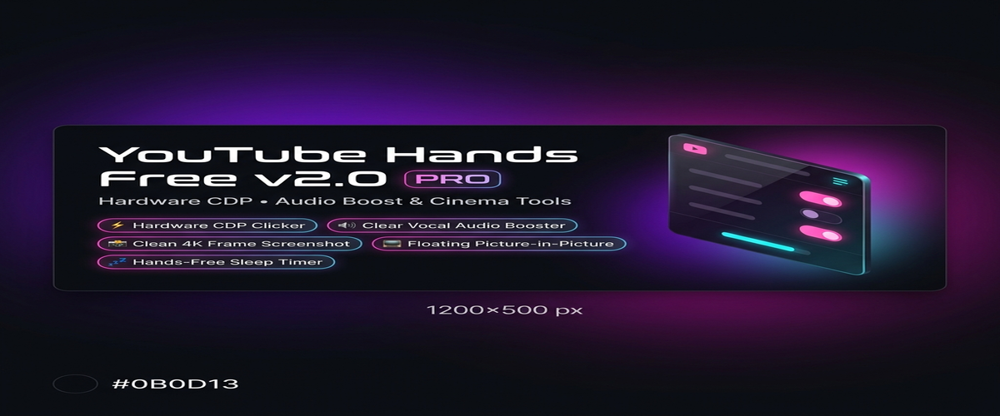
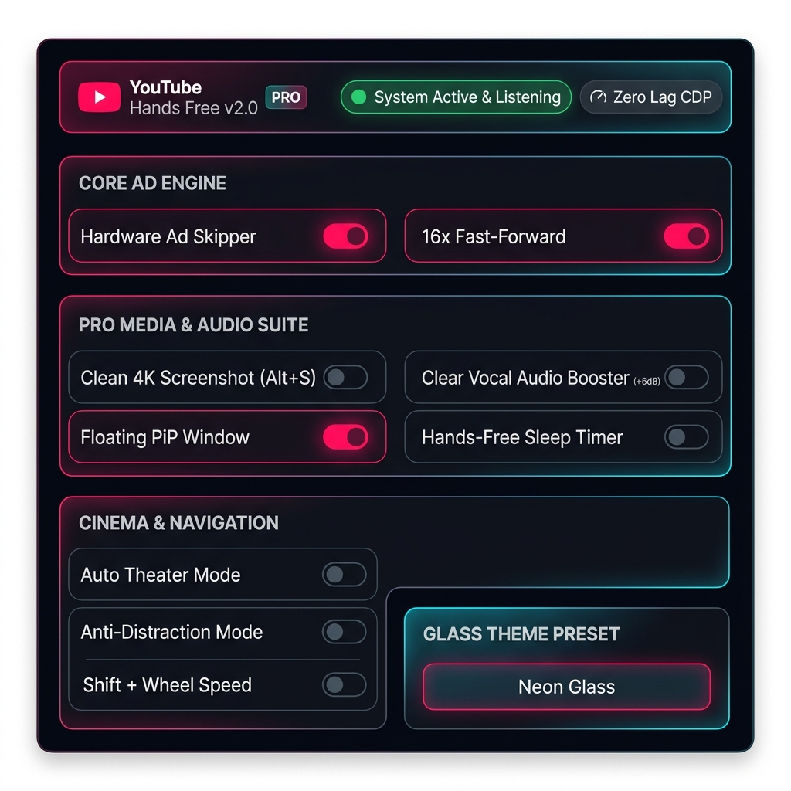

<div align="center">



# ⚡ YouTube Hands Free
### Hardware CDP • 1080p Premium Enhanced Bitrate • Vocal Audio Boost & Cinema Tools

[](https://opensource.org/licenses/MIT)
[](https://developer.chrome.com/docs/extensions/mv3/intro/)
[](PRIVACY.md)
[](https://github.com/sasohan0/youtube-hands-free/stargazers)
[](http://makeapullrequest.com)

**YouTube Hands Free** is an ultra-sleek, zero-latency Chrome extension that automatically bypasses, skips, and fast-forwards YouTube video ads using **hardware-level Chrome DevTools Protocol (CDP)** inputs, an **AI Voice Command Engine**, a **1080p Premium Enhanced Bitrate & 4K Stream Lock**, a **Clear Vocal Audio Booster**, **Clean 4K Frame Screenshot (`Alt + S`)**, **Floating Picture-in-Picture (`Alt + P`)**, **Hands-Free Sleep Timer**, and an **Anti-Distraction Suite**.

[Features](#-key-features) • [1080p Premium](#-1080p-premium-enhanced-bitrate-unlocker) • [Voice Commands](#-voice-command-engine) • [Installation](#-installation-guide) • [Star Roadmap](#-star-milestone-roadmap)

---

### 🌟 Enjoying YouTube Hands Free? Give it a Star!

> **If this extension saved you time or enhanced your YouTube viewing, please consider giving this repository a Star ⭐!**  
> It takes 2 seconds and helps independent open-source developers keep building free, privacy-first tools!

[](https://github.com/sasohan0/youtube-hands-free/stargazers)
[](https://twitter.com/intent/tweet?text=Check%20out%20YouTube%20Hands%20Free%20-%20an%20awesome%20open-source%20Chrome%20extension%20for%20skipping%20ads%20%26%20boosting%20audio!%20%E2%AD%90%20https://github.com/sasohan0/youtube-hands-free)
[](https://www.reddit.com/submit?url=https://github.com/sasohan0/youtube-hands-free&title=YouTube%20Hands%20Free%20-%20Hardware%20CDP%20Ad%20Skipper%20%26%201080p%20Premium%20Unlocker)

</div>

---

## 📸 Visual Glassmorphic Control Center

<div align="center">
  
  <p><em>State-of-the-Art Obsidian Glassmorphic Dashboard with 1080p Premium Lock, Audio Booster, 4K Screenshot, Floating PiP, Sleep Timer, and Glass Theme Presets.</em></p>
</div>

---

## ✨ Key Features

- ⚡ **1080p Premium Enhanced Bitrate & 4K Lock**: Enforces YouTube's maximum quality **1080p Premium (Enhanced bitrate)** video stream and 4K/60fps streams without requiring a YouTube Premium subscription.
- 🎯 **Hardware-Level CDP Clicker**: Dispatches real OS-level `Input.dispatchMouseEvent` via Chrome DevTools Protocol for 0ms delay hardware ad skipping.
- 🔊 **🎛️ Clear Vocal Audio Booster**: Web Audio API peaking filter boosting 2kHz speech clarity by +6dB and overall volume by +35% for crystal-clear dialogue.
- 📸 **Clean 4K Video Frame Screenshot (`Alt + S`)**: Instant uncompressed 4K video frame PNG capture directly from `<video>` canvas, stripping player UI controls and timeline bars. Also features a **📸 1-click camera button** right on YouTube's player control bar!
- 📺 **Floating Picture-in-Picture (`Alt + P`)**: Pop out any YouTube video into a floating, resizable OS window (`video.requestPictureInPicture()`).
- 💤 **Hands-Free Sleep Timer**: Built-in 15m, 30m, 45m, and 60m sleep timer that automatically pauses video playback when time expires.
- 🤝 **Creator Fair-Play Safeguard Mode**: Optionally waits 5 seconds before skipping ads to ensure video creators receive YouTube ad impression revenue credit.
- 🔒 **100% Local Privacy Guarantee**: Zero remote telemetry, zero analytics tracking, and zero data collection. All settings stay in your browser.
- 🎭 **Auto-Theater Mode**: Automatically expands YouTube player into full Cinema / Theater Mode when a video starts playing.
- 🛡️ **Anti-Distraction Suite**: Automatically suppresses YouTube Shorts shelves, Premium upgrade popups, and promotional survey banners.
- ⚡ **Shift + Scroll Speed Controller**: Hold `Shift` and scroll anywhere over the video player to smoothly adjust playback speed (`0.25x` to `4.00x`) with a Glass Toast HUD alert.
- 🔔 **Upcoming Ad Announcement HUD**: Displays an on-screen Glass Tooltip notification 5s before an ad break triggers (`⚡ Upcoming Ad in ~5s`).
- ⏱️ **Time Saved Counter**: Automatically calculates and displays cumulative seconds/minutes saved from skipped & accelerated ads.
- 🎤 **Hands-Free Voice Command Engine**: Control playback and skip ads effortlessly using real-time speech recognition ("Skip", "Pause", "Play", "Mute", "Speed up").
- ⏩ **16x Speed Unskippable Ad Fast-Forwarding**: Instantly speeds through unskippable ads at 16.0x playback rate while auto-muting rapid audio.

---

## ⚡ 1080p Premium Enhanced Bitrate Unlocker

YouTube provides a higher bitrate video stream labeled **1080p Premium HD (Enhanced bitrate)**. 

- **How YouTube Hands Free Unlocks Enhanced Bitrate**:
  1. Intercepts the HTML5 Player API (`setPlaybackQualityRange`, `setPlaybackQuality`) to enforce maximum bitrate stream profiles (`highres`, `hd2160`, `hd1440`, `hd1080`).
  2. Automatically selects `"1080p Premium"` from YouTube's quality menu option when available, ensuring maximum visual fidelity and zero video compression artifacts.

---

## 🎤 Voice Command Engine

Activate the **Voice Command Engine** toggle in the popup to speak commands directly while watching YouTube. An on-screen Glassmorphic HUD toast will confirm actions in real time!

| Voice Command | Triggered Action |
| :--- | :--- |
| **"Skip"** / **"Skip Ad"** / **"Next Ad"** | Clicks skip button immediately via CDP |
| **"Pause"** | Pauses YouTube video playback |
| **"Play"** / **"Start"** | Resumes video playback |
| **"Mute"** | Mutes video audio |
| **"Unmute"** | Restores video audio |
| **"Speed Up"** / **"Fast"** | Sets video playback speed to `2.0x` |
| **"Normal Speed"** | Restores playback speed to `1.0x` |

---

## 🏆 Star Milestone Roadmap

We build based on community demand! Help us reach our next open-source milestone by dropping a ⭐:

- [x] ⭐ **50 Stars**: Pro Media Suite (Audio Booster, 4K Screenshot, Floating PiP, Sleep Timer)
- [ ] ⭐ **100 Stars**: Firefox Add-ons & Microsoft Edge Web Store release
- [ ] ⭐ **250 Stars**: Custom Web Audio 10-Band Graphic Equalizer (EQ) preset manager
- [ ] ⭐ **500 Stars**: Safari & iOS Extension Port

---

## 🚀 Installation Guide

### Prerequisites
- Google Chrome, Brave, Edge, or any Chromium-based browser supporting Manifest V3.

### Quick Setup Steps

1. **Clone the repository**:
   ```bash
   git clone https://github.com/sasohan0/youtube-hands-free.git
   ```
2. Open Chrome and navigate to `chrome://extensions/`.
3. Enable **Developer mode** in the top right corner.
4. Click **Load unpacked** and select the repository folder.
5. Pin **YouTube Hands Free** to your Chrome toolbar and enjoy a zero-ad, enhanced audio YouTube experience!

---

## 🤝 Contributing & Community

Contributions are warmly welcome! Whether fixing bugs, optimizing selectors, or improving UI animations:

1. Fork the Project
2. Create your Feature Branch (`git checkout -b feature/AmazingFeature`)
3. Commit your Changes (`git commit -m 'feat: add amazing feature'`)
4. Push to the Branch (`git push origin feature/AmazingFeature`)
5. Open a Pull Request

Check out our complete growth playbook in [`MARKETING.md`](MARKETING.md).

---

## 📄 License & Privacy

Distributed under the **MIT License**. See [`LICENSE`](LICENSE) for more information.  
100% Private, zero data collection. See [`PRIVACY.md`](PRIVACY.md).

---

<div align="center">

### ⭐ Star This Repository If You Found It Helpful! ⭐

[](https://github.com/sasohan0/youtube-hands-free/stargazers)

*Created with ❤️ by [sasohan0](https://github.com/sasohan0)*

</div>
